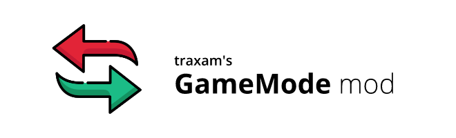



# GameMode mod
*([view on RaftModding](https://www.raftmodding.com/mods/gamemode))*

This mod allows you to change your game mode while being in-game.

## Usage
1. Open the console (press `F10`).
2. Type in `gamemode` <`Normal|Hardcore|Creative|Easy|None|Peaceful`> to change your current game mode.
    
    **example:** `gamemode Creative` changes your current game mode to creative mode, allowing you to get unlimited items.

## Credits
* code: [traxam](https://trax.am)
* arrows icon: [Freepik](https://www.flaticon.com/authors/freepik) from [www.flaticon.com](https://www.flaticon.com/)